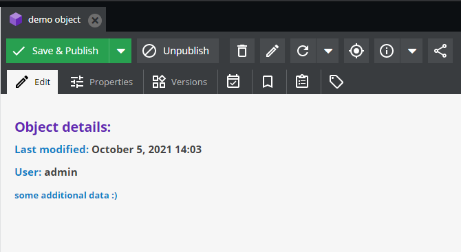

# Dynamic Text Labels

Similar to the [CalculatedValue](../../../05_Objects/01_Object_Classes/01_Data_Types/10_Calculated_Value_Type.md) data type,
it is possible to generate the Layout Text dynamically based on the current object and the label's context.
There are alternative approaches to the static text defined in the class definition.

There are two ways to define dynamic text labels:

1) Renderer Class

A custom renderer service which implements `DynamicTextLabelInterface` and in turn returns dynamic text string from `renderLayoutText` method. It is possible to pass additional data (*some additional data :)* in this example) to the rendering method.


Here is an example for a rendering class.

```php
<?php

namespace App\Helpers;

use Pimcore\Model\DataObject\Concrete;

class CustomRenderer implements DynamicTextLabelInterface
{
    /**
     * @param string $data as provided in the class definition
     * @param Concrete|null $object
     * @param mixed $params
     *
     * @return string
     */
    public function renderLayoutText($data, $object, $params) {
        $text = '<h1 style="color: #F00;">Last reload: ' . date('c') . '</h1>' .
            '<h2>Additional Data: ' . $data . '</h2>';

        if ($object) {
            $text .= '<h3>BTW, my fullpath is: ' . $object->getFullPath() . ' and my ID is ' . $object->getId() . '</h3>';
        }

        return $text;
    }
}
```

*$data* will contain the additional data from the class definition. In *$params* you will find additional information about the current context.
For example: If the text label lives inside a field collection, *$params* will contain the name of the field collection (and of course the name of the label itself).

The result will be as follows:


2) Twig Template

A template can be provided, which is rendered everytime on object open event. The template is rendered with additional data passed from class definition along with other contextual information as follows: 
   - `fieldname`: Name of the text layout field
   - `layout`: Layout definition of the text layout field
   - `object`: current object instance
   - `data`: additional data defined in the class definition

Here is an example of Twig template:

Create a template file in `templates` folder or in Bundle resources: e.g., `templates/content/text-layout.html.twig`
```twig
<div class="container">
    
    <h2 style="color: #6428b4"> {{ 'Object details:' }}</h2>
    <h3><span style="color: #0B7FC7">{{ 'Last modified: ' }}</span> {{ object.getModificationDate()|date }}</h3>
    <h3><span style="color: #0B7FC7">{{ 'User: ' }}</span> {{ userModification.getName() }}</h3>
    <h4 style="color: #0B7FC7">{{ data }}</h4>
</div>
```


